# 🏗️ Backend Architecture - Intelligent Support Ecosystem

## 📋 **OVERVIEW**

Complete backend architecture for the intelligent support ecosystem with auto-documentation, AI services, and continuous deployment synchronization.

---

## 🎯 **SYSTEM ARCHITECTURE**

```
┌─────────────────────────────────────────────────────────────┐
│                     FRONTEND (React)                         │
│  - Support Flow Router                                       │
│  - Collaborative Annotation                                  │
│  - Session Analytics                                         │
│  - Training Module Manager                                   │
└─────────────────────┬───────────────────────────────────────┘
                      │
                      ▼
┌─────────────────────────────────────────────────────────────┐
│                  API GATEWAY (Express)                       │
│  - Authentication & Authorization                            │
│  - Rate Limiting                                             │
│  - Request Validation                                        │
│  - API Versioning                                            │
└─────────────────────┬───────────────────────────────────────┘
                      │
        ┌─────────────┼─────────────┐
        ▼             ▼             ▼
┌──────────────┐ ┌──────────────┐ ┌──────────────┐
│   FIREBASE   │ │  WEBSOCKET   │ │  AI SERVICES │
│   SERVICES   │ │    SERVER    │ │              │
└──────────────┘ └──────────────┘ └──────────────┘
        │             │             │
        ▼             ▼             ▼
┌──────────────────────────────────────────────────┐
│            BACKGROUND SERVICES                    │
│  - Auto-Documentation Pipeline                   │
│  - Video Generation System                       │
│  - CI/CD Integration                             │
│  - Analytics Processing                          │
└──────────────────────────────────────────────────┘
```

---

## 🔧 **CORE SERVICES**

### 1. **API Gateway Service**
**Purpose:** Central entry point for all backend requests

**Technology:** Express.js + TypeScript

**Responsibilities:**
- Authentication (Firebase Auth)
- Rate limiting (Redis)
- Request validation (Joi/Zod)
- API versioning
- Error handling
- Logging & monitoring

**Endpoints:**
```
/api/v1/support/route          - Support routing
/api/v1/annotations            - Collaborative annotations
/api/v1/analytics/sessions     - Session analytics
/api/v1/training/modules       - Training modules
/api/v1/training/progress      - User progress
/api/v1/documentation/generate - Auto-documentation
/api/v1/videos/generate        - Video generation
```

---

### 2. **WebSocket Service**
**Purpose:** Real-time communication for collaboration

**Technology:** Socket.io + Redis

**Features:**
- Real-time annotation sync
- Collaborative cursors
- Typing indicators
- Session presence
- Live updates

**Events:**
```typescript
// Client → Server
'annotation:add'
'annotation:delete'
'cursor:move'
'typing:start'
'typing:stop'
'session:join'
'session:leave'

// Server → Client
'annotation:added'
'annotation:deleted'
'cursor:moved'
'user:typing'
'user:joined'
'user:left'
```

---

### 3. **AI Services**

#### 3.1 Support Route Recommendation
**Purpose:** Intelligent routing based on issue analysis

**Technology:** OpenAI GPT-4 / Claude

**Input:**
```typescript
{
  issue: string;
  urgency: 'low' | 'medium' | 'high' | 'critical';
  customerHistory: {
    previousIssues: string[];
    preferredChannel: string;
    successfulChannels: string[];
  }
}
```

**Output:**
```typescript
{
  recommendedRoute: 'ai-chatbot' | 'live-chat' | 'co-browse' | 'video-call';
  confidence: number; // 0-1
  reasoning: string;
  alternativeRoutes: Array<{
    route: string;
    score: number;
  }>;
}
```

**Algorithm:**
```python
def recommend_route(issue, urgency, history):
    # Extract keywords
    keywords = extract_keywords(issue)
    
    # Analyze complexity
    complexity = analyze_complexity(keywords, urgency)
    
    # Check history
    historical_success = get_historical_success(history)
    
    # Score each route
    scores = {
        'ai-chatbot': score_chatbot(complexity, keywords),
        'live-chat': score_live_chat(complexity, urgency),
        'co-browse': score_co_browse(keywords, complexity),
        'video-call': score_video_call(urgency, complexity)
    }
    
    # Apply historical weights
    weighted_scores = apply_history_weight(scores, historical_success)
    
    # Return best match
    return max(weighted_scores, key=weighted_scores.get)
```

#### 3.2 Sentiment Analysis
**Purpose:** Analyze customer sentiment in real-time

**Technology:** Hugging Face Transformers / OpenAI

**Model:** `distilbert-base-uncased-finetuned-sst-2-english`

**Input:** Chat message or support request

**Output:**
```typescript
{
  sentiment: 'positive' | 'neutral' | 'negative';
  score: number; // 0-1
  emotions: {
    joy: number;
    anger: number;
    frustration: number;
    satisfaction: number;
  };
  urgencyLevel: number; // 1-10
}
```

#### 3.3 Auto-Categorization
**Purpose:** Automatically categorize support requests

**Technology:** Fine-tuned BERT model

**Categories:**
- Approval
- Revision
- Question
- Urgent
- Technical
- General

**Training Data:**
```python
# Train on historical support tickets
training_data = [
    ("Need to approve this proof ASAP", "approval"),
    ("Can you fix the bleed settings?", "revision"),
    ("How do I export to PDF?", "question"),
    ("Production is blocked!", "urgent"),
    ("Color profile not working", "technical"),
    ("Just checking in", "general")
]
```

---

### 4. **Auto-Documentation Pipeline**

#### 4.1 Change Detection Service
**Purpose:** Monitor code changes and trigger documentation updates

**Technology:** Node.js + Git hooks

**Process:**
```typescript
class ChangeDetectionEngine {
  async detectChanges(commit: GitCommit) {
    // 1. Parse commit
    const changes = await this.parseCommit(commit);
    
    // 2. Analyze changes
    const analysis = {
      uiChanges: this.detectUIChanges(changes),
      apiChanges: this.detectAPIChanges(changes),
      featureAdditions: this.detectNewFeatures(changes),
      bugFixes: this.detectBugFixes(changes)
    };
    
    // 3. Generate documentation tasks
    const tasks = this.generateDocTasks(analysis);
    
    // 4. Queue for processing
    await this.queueTasks(tasks);
    
    return analysis;
  }
  
  detectUIChanges(changes: FileChange[]) {
    // Screenshot comparison
    // DOM structure analysis
    // Component detection
  }
  
  detectAPIChanges(changes: FileChange[]) {
    // Endpoint changes
    // Parameter modifications
    // Response schema updates
  }
}
```

#### 4.2 Documentation Generator
**Purpose:** AI-powered documentation creation

**Technology:** OpenAI GPT-4 + Templates

**Input:**
```typescript
{
  changeType: 'ui' | 'api' | 'feature' | 'bugfix';
  files: string[];
  diff: string;
  commitMessage: string;
  jiraTicket?: string;
}
```

**Output:**
```typescript
{
  userDocumentation: {
    title: string;
    overview: string;
    steps: string[];
    screenshots: string[];
    tips: string[];
  };
  technicalDocumentation: {
    apiChanges: string;
    breaking: boolean;
    migration: string;
  };
  trainingMaterial: {
    videoScript: string;
    quizQuestions: Array<{
      question: string;
      options: string[];
      correct: number;
    }>;
  };
}
```

**Prompt Template:**
```
You are a technical documentation expert. Generate comprehensive documentation for the following code change:

Change Type: {changeType}
Files Modified: {files}
Commit Message: {commitMessage}

Code Diff:
{diff}

Generate:
1. User-facing documentation (non-technical)
2. Technical API documentation
3. Training video script
4. Quiz questions for knowledge verification

Format as JSON following the schema provided.
```

#### 4.3 Training Content Updater
**Purpose:** Automatically update training materials

**Technology:** Node.js + Firebase

**Process:**
```typescript
class TrainingContentManager {
  async updateTraining(documentation: Documentation) {
    // 1. Identify affected modules
    const modules = this.identifyAffectedModules(documentation);
    
    // 2. Generate updates
    for (const module of modules) {
      // Update video scripts
      await this.updateVideoScript(module, documentation);
      
      // Update interactive tutorials
      await this.updateTutorial(module, documentation);
      
      // Update quiz questions
      await this.updateQuiz(module, documentation);
      
      // Update help tooltips
      await this.updateTooltips(module, documentation);
    }
    
    // 3. Notify stakeholders
    await this.notifyUpdates(modules);
  }
}
```

---

### 5. **Video Generation System**

#### 5.1 Automated Screen Recording
**Purpose:** Generate tutorial videos automatically

**Technology:** Puppeteer + FFmpeg

**Process:**
```typescript
class VideoGenerator {
  async generateVideo(script: VideoScript) {
    // 1. Launch browser
    const browser = await puppeteer.launch({
      headless: true,
      args: ['--window-size=1920,1080']
    });
    
    // 2. Navigate and record
    const page = await browser.newPage();
    await page.setViewport({ width: 1920, height: 1080 });
    
    // Start recording
    const recorder = new ScreenRecorder(page);
    await recorder.start();
    
    // 3. Execute script actions
    for (const action of script.actions) {
      await this.executeAction(page, action);
      await this.addAnnotation(action.annotation);
      await this.wait(action.duration);
    }
    
    // 4. Stop recording
    const videoBuffer = await recorder.stop();
    
    // 5. Add narration
    const narration = await this.generateNarration(script.narration);
    const finalVideo = await this.mergeAudioVideo(videoBuffer, narration);
    
    // 6. Add effects
    const enhanced = await this.addEffects(finalVideo, {
      zoom: script.zoom,
      highlights: script.highlights,
      transitions: script.transitions
    });
    
    return enhanced;
  }
  
  async executeAction(page: Page, action: Action) {
    switch (action.type) {
      case 'click':
        await page.click(action.selector);
        break;
      case 'type':
        await page.type(action.selector, action.text);
        break;
      case 'scroll':
        await page.evaluate((y) => window.scrollTo(0, y), action.y);
        break;
      case 'hover':
        await page.hover(action.selector);
        break;
    }
  }
}
```

#### 5.2 Voice Synthesis
**Purpose:** Generate narration for videos

**Technology:** Google Cloud Text-to-Speech / ElevenLabs

**Configuration:**
```typescript
{
  voice: 'en-US-Neural2-J', // Professional female voice
  speakingRate: 0.95,
  pitch: 0,
  volumeGainDb: 0,
  audioEncoding: 'MP3'
}
```

---

### 6. **CI/CD Integration**

#### 6.1 Deployment Monitor
**Purpose:** Track deployments and trigger updates

**Technology:** GitHub Actions / GitLab CI

**Workflow:**
```yaml
name: Deploy and Update Documentation

on:
  push:
    branches: [main]

jobs:
  deploy:
    runs-on: ubuntu-latest
    steps:
      - uses: actions/checkout@v2
      
      - name: Detect Changes
        run: node scripts/detect-changes.js
        
      - name: Generate Documentation
        run: node scripts/generate-docs.js
        
      - name: Update Training
        run: node scripts/update-training.js
        
      - name: Generate Videos
        run: node scripts/generate-videos.js
        
      - name: Deploy Application
        run: npm run deploy
        
      - name: Notify Stakeholders
        run: node scripts/notify.js
```

#### 6.2 Feature Flag Integration
**Purpose:** Track feature rollouts

**Technology:** LaunchDarkly / Firebase Remote Config

**Implementation:**
```typescript
class FeatureFlagTracker {
  async onFlagChange(flag: FeatureFlag) {
    // 1. Detect flag activation
    if (flag.enabled && !flag.previouslyEnabled) {
      // 2. Generate documentation
      await this.generateFeatureDocs(flag);
      
      // 3. Update training
      await this.updateTraining(flag);
      
      // 4. Notify users
      await this.notifyUsers(flag);
    }
  }
}
```

---

## 📊 **DATABASE SCHEMA**

### Firebase Firestore Collections

#### `supportSessions`
```typescript
{
  id: string;
  customerId: string;
  agentId?: string;
  type: 'ai-chatbot' | 'live-chat' | 'co-browse' | 'video-call';
  status: 'queued' | 'active' | 'completed' | 'cancelled';
  startTime: Timestamp;
  endTime?: Timestamp;
  duration?: number;
  resolution: 'resolved' | 'escalated' | 'unresolved';
  satisfaction?: number;
  transcript: string;
  annotations: Annotation[];
  metadata: {
    issue: string;
    urgency: string;
    tags: string[];
  };
}
```

#### `annotations`
```typescript
{
  id: string;
  sessionId: string;
  userId: string;
  type: 'pen' | 'highlight' | 'text' | 'shape' | 'note' | 'stamp';
  data: any;
  timestamp: Timestamp;
  layer: number;
  synced: boolean;
}
```

#### `trainingModules`
```typescript
{
  id: string;
  title: string;
  description: string;
  category: 'customer' | 'staff';
  type: 'video' | 'interactive' | 'quiz' | 'practice';
  content: {
    videoUrl?: string;
    script?: string;
    steps?: Step[];
    quiz?: Question[];
  };
  version: number;
  lastUpdated: Timestamp;
  autoGenerated: boolean;
  status: 'draft' | 'review' | 'published';
}
```

#### `userProgress`
```typescript
{
  userId: string;
  moduleId: string;
  progress: number; // 0-100
  completed: boolean;
  startedAt: Timestamp;
  completedAt?: Timestamp;
  quizScores: number[];
  timeSpent: number; // seconds
  achievements: string[];
}
```

#### `documentation`
```typescript
{
  id: string;
  type: 'feature' | 'api' | 'guide' | 'changelog';
  title: string;
  content: string;
  version: string;
  relatedCommit: string;
  autoGenerated: boolean;
  reviewed: boolean;
  publishedAt?: Timestamp;
  tags: string[];
  searchKeywords: string[];
}
```

#### `sessionAnalytics`
```typescript
{
  id: string;
  date: Timestamp;
  metrics: {
    totalSessions: number;
    avgDuration: number;
    resolutionRate: number;
    satisfaction: number;
    escalationRate: number;
  };
  channelBreakdown: {
    [channel: string]: {
      sessions: number;
      avgDuration: number;
      resolution: number;
    };
  };
  topTopics: Array<{
    topic: string;
    count: number;
  }>;
}
```

---

## 🔐 **SECURITY & AUTHENTICATION**

### Firebase Security Rules

```javascript
rules_version = '2';
service cloud.firestore {
  match /databases/{database}/documents {
    
    // Support Sessions
    match /supportSessions/{sessionId} {
      allow read: if request.auth != null && (
        resource.data.customerId == request.auth.uid ||
        resource.data.agentId == request.auth.uid ||
        hasRole('admin')
      );
      allow create: if request.auth != null;
      allow update: if request.auth != null && (
        resource.data.agentId == request.auth.uid ||
        hasRole('agent') ||
        hasRole('admin')
      );
    }
    
    // Annotations
    match /annotations/{annotationId} {
      allow read: if request.auth != null;
      allow create: if request.auth != null;
      allow delete: if request.auth != null && (
        resource.data.userId == request.auth.uid ||
        hasRole('admin')
      );
    }
    
    // Training Modules
    match /trainingModules/{moduleId} {
      allow read: if request.auth != null;
      allow write: if hasRole('admin') || hasRole('training-manager');
    }
    
    // User Progress
    match /userProgress/{progressId} {
      allow read: if request.auth != null && (
        resource.data.userId == request.auth.uid ||
        hasRole('admin')
      );
      allow write: if request.auth != null && 
        resource.data.userId == request.auth.uid;
    }
    
    // Helper function
    function hasRole(role) {
      return request.auth != null && 
        get(/databases/$(database)/documents/users/$(request.auth.uid))
          .data.role == role;
    }
  }
}
```

---

## 📈 **SCALABILITY & PERFORMANCE**

### Caching Strategy

```typescript
// Redis caching layers
const cacheConfig = {
  // API responses
  apiCache: {
    ttl: 300, // 5 minutes
    keys: [
      'analytics:*',
      'training:modules',
      'documentation:*'
    ]
  },
  
  // Session data
  sessionCache: {
    ttl: 3600, // 1 hour
    keys: [
      'session:*:annotations',
      'session:*:participants'
    ]
  },
  
  // AI results
  aiCache: {
    ttl: 86400, // 24 hours
    keys: [
      'ai:route:*',
      'ai:sentiment:*',
      'ai:category:*'
    ]
  }
};
```

### Load Balancing

```nginx
upstream api_servers {
  least_conn;
  server api1.example.com:3000;
  server api2.example.com:3000;
  server api3.example.com:3000;
}

upstream websocket_servers {
  ip_hash; # Sticky sessions for WebSocket
  server ws1.example.com:3001;
  server ws2.example.com:3001;
}
```

---

## 🔄 **DEPLOYMENT PIPELINE**

```mermaid
graph LR
    A[Code Push] --> B[CI/CD Trigger]
    B --> C[Run Tests]
    C --> D[Detect Changes]
    D --> E[Generate Docs]
    E --> F[Update Training]
    F --> G[Generate Videos]
    G --> H[Deploy to Staging]
    H --> I[QA Review]
    I --> J[Deploy to Production]
    J --> K[Notify Users]
```



---

## 📝 **API DOCUMENTATION**

Complete API documentation will be auto-generated using the documentation pipeline and available at `/api/docs`.

---

**Next:** Implementation of backend services →
